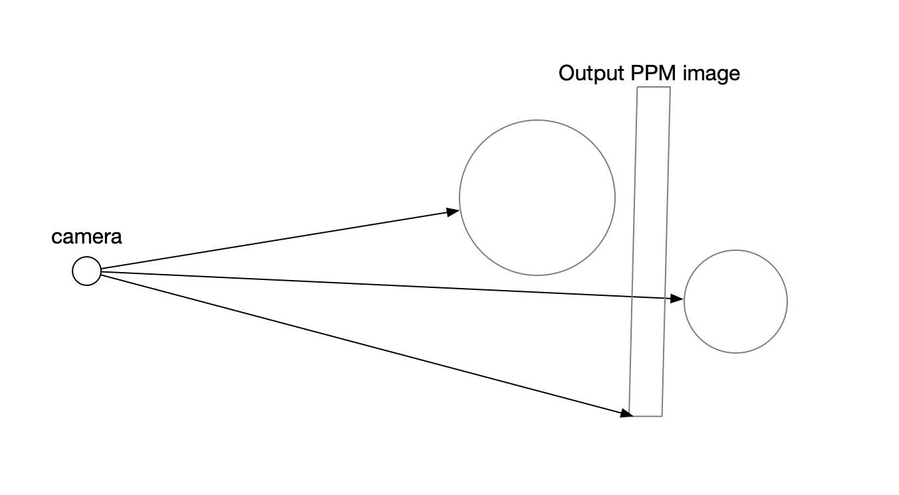

&emsp;&emsp;作者在这一章构建了一个可以移动视角（摄像机位置，摄像机看向的方向，摄像机视角以及视角比例可改变）的摄像机类。
&emsp;&emsp;在之前的章节，我们的摄像机一直处于下图的状态：

摄像机从右下角一个像素一个像素地将追踪情况写入 ppm 文件中。对于摄像机和输出平面（output ppm image）来说，它们应该是摄像机处于输出平面中心位置（x，y 轴），距离输出平面 z 距离。因此，如果想要移动摄像机，就必须移动平面，使其与摄像机的位置保持上述关系。作者将摄像机看向的方向设置为 lookat，摄像机位置为 lookfrom，前两者的与视角的关系如下图所示：

图中的 u，v，-w 可以看做一个坐标系，-w 的选取是为了使其符合右手坐标系。我们所要做的就是先构建坐标系，然后将原先的光线全部转换到当前坐标系下，由于构建过程并不复杂，这里就不赘述了，具体请参阅原文中的源代码。