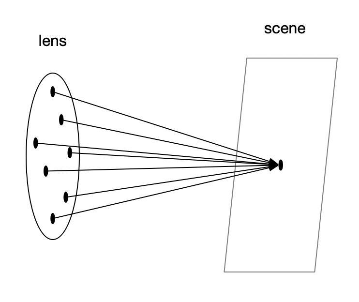
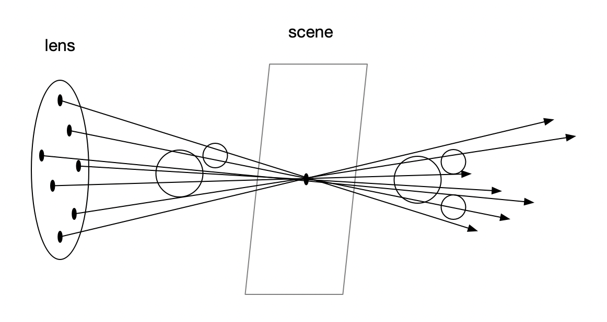
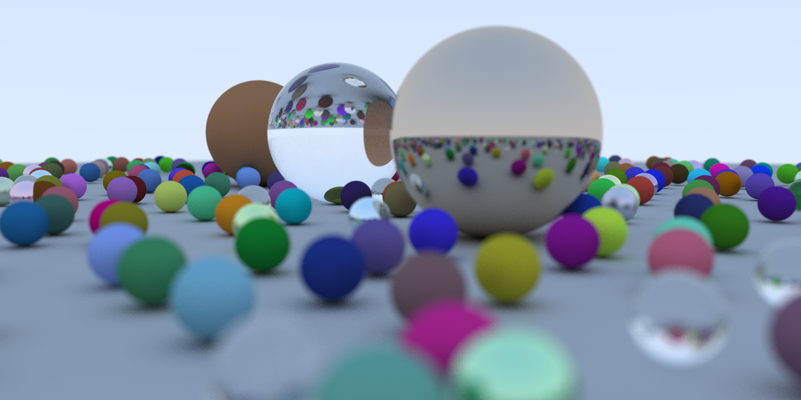

&emsp;&emsp;本章的内容我看的有点迷糊，所以结合了几篇博客去看，引用博客如下：
1. https://www.jianshu.com/p/dc801008ee27?from=groupmessage&isappinstalled=0
2. https://www.cnblogs.com/lv-anchoret/p/10223222.html
3. https://www.cnblogs.com/AirGuanZ/p/6363175.html
4. https://blog.csdn.net/FreeSouthS/article/details/90383966

由于胶片在这里就是我们要输出的图像，所以我们只需要模拟镜片（camera）和 聚焦平面（scene）即可。

图中 lens  上的黑点为随机生成的原点，用于模拟透镜接受物体反射过来的各个方向的光线的情况。焦距为 lens 到 scene 距离 n，与 lens 距离等于 n 的物体都能被清晰的映射在输出平面上，若物体不在焦距平面，则情况如下图：

图中圆形仅代表不同球体的位置。对于相邻的像素，例如球体边缘，由于两次光线均为原先的相机位置加上一个随机偏移量，因此很难产生连续清晰的边缘，最终导致物体的模糊。同时也可以明显看出，当 lens 半径越大（光圈越大），物体会越模糊（随机偏移向量的长度范围越大）。作者代码中，用焦距与输出图像的长宽相乘，是因为之前的长宽均是在 z = 1（摄像机到成像平面的距离）的前提下，计算的 h 与 w（还记得前一章中作者在原文中提到的 half_width 和 half_height 的计算方法吗）。本章是在 z 等于焦距（lookfrom 和 lookat 间距）的前提下计算的，因此需要这样操作。
&emsp;&emsp;我在这里直接整合最后随机生成小球的代码，一并放在了 code 中。附上代码运行后的结果图（2000 * 1000 分辨率）：

渲染共花费了 11075 秒，展示的图像是从 https://convertio.co/zh/ppm-png/ 这个网站将 ppm 文件转换为 png 文件的。