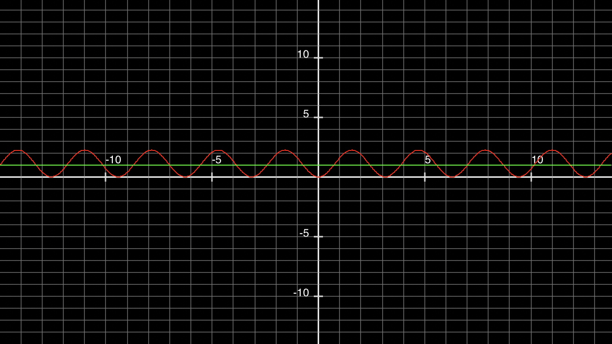

&emsp;&emsp;作者在本章对实现了电介质（玻璃，水，钻石等等）的折射效果。然而在实际情况中，对于折射率（光在真空中传播的速度与光在介质中传播速度的比值）较高的介质，在某个角度会出现镜面的情况（例如你在水中，水面与空气交界处的镜面效果）。
&emsp;&emsp;折射角度可以用以下公式计算（n 在这里为折射率）：
$$n * sin(θ_1) = n' * sin(θ_2)\tag{1}$$
教程中的图示对代码的诠释不是清晰，具体计算方式可以用下面的步骤来理解：
对于一次发生在不同介质的折射，有入射光线 v，入射光线的单位向量 uv，法向量 n，有折射光线 r，入射角 $θ_1$，折射角 $θ_2$，如下图所示（上方为空气，下方为电介质）：
<div align = center>

</div>
我们跟着代码一点一点分析吧。总的代码如下：
```c++
bool refract(const vec3& v, const vec3& n, float ni_over_nt, vec3& refracted) {
    vec3 uv = unit_vector(v);
    float dt = dot(uv, n);
    float discriminant = 1.0 - ni_over_nt*ni_over_nt*(1-dt*dt);
    if (discriminant > 0) {
        refracted = ni_over_nt*(uv - n*dt) - n*sqrt(discriminant);
        return true;
    }
    else
        return false;
}
```
第二，三行就不做解释了，它是对入射向量的单位化以及计算 uv 和 法向量 n 之间角度 $θ_1$ 的余弦值 $cos(θ_1)$，我们从 discriminant 那一行看起
```c++
float discriminant = 1.0 - ni_over_nt*ni_over_nt*(1-dt*dt);
```
```1-dt*dt``` 实际上是计算了 $sin^2(θ_1)$，```ni_over_nt``` 变量对应着值 $\frac{n}{n'}$，因此 ```ni_over_nt*ni_over_nt*(1-dt*dt)``` 计算的是 $sin^2(θ_2)$，那么 ```discriminant``` 就表示 $cos^2(θ_2)$。上式小于 0 的不等式为：
$$\frac{n_i}{n_r}^2 * sin(θ_1)^2>1$$
取 ni_over_nt = 1.5，时，$2.25 * sin(x)^2 = y$ 部分函数图像如下（图由应用 MyGraphCalc 生成，绿色直线表示 y=1）：
<div align = center>

</div>
由不等式可知在绿线上侧的角度是不发生折射的，这与我们在水下观察空气和水面交界处时，一定角度发生折射，一定角度发生反射的情况一致。
&emsp;&emsp;倘若发生折射，```refracted = ni_over_nt*(uv - n*dt) - n*sqrt(discriminant);``` 这行代码是怎么计算出折射光线的方向呢？先看 ```(uv - n*dt)```，这个代码的含义如图所示（注意，此时 uv 与 n 的夹角大于 90°，因此 n 会改变方向）：
<div align = center>

</div>

之前也说过，dt 为 $cos(θ_1)$，因此可以看出来 ```(uv - n*dt)``` 表示的向量。我们对公式 1 进行变形，得到如下形式：
$$\frac{n}{n'} = \frac{sin(θ_2)}{sin(θ_1)}\tag{2}$$ 因此 ```ni_over_nt*(uv - n*dt)``` 得出的结果如下图所示：
<div align = center>

</div>

现在已经很显而易见了，最终的折射光线可以用 ni_over_nt*(uv - n*dt) - n*cos(θ2) 求出，这恰好与 ```refracted = ni_over_nt*(uv - n*dt) - n*sqrt(discriminant);``` 中实现的一样。
&emsp;&emsp;除了上方为空气，下方为电介质的情况，还需要考虑从电介质中射出到空气的情况。但是要注意，此时发现方向要取反，因为法向量方向由圆心射向空气，与入射光线（电介质内）夹角的余弦值为正，所以用上述代码无法计算出正确结果，具体的可以自己按照上面的步骤推一推。
&emsp;&emsp;然而上述工作只是计算了物体的折射情况，对于玻璃来说，以与法线夹角近似于 90° 的角度观察时，镜面反射会很明显。这个现象叫做 Fresnel，关于 Fresnel 现象的介绍可以参阅 [Everything has Fresnel](http://filmicworlds.com/blog/everything-has-fresnel/)。本书的作者认为原公式非常复杂，因此使用了 Christophe Schlick 推导的多项式逼近公式。该公式的详情可以参阅 [Wikipedia](https://en.wikipedia.org/wiki/Schlick%27s_approximation)。我在这里简要列出该公式以及公式中涉及的参数：
$$R(θ)=R_0+(1-R_0)(cos(θ))$$ $$R_0 = (\frac{n_1-n_2}{n_1+n_2})^2$$ 上述公式中 θ 表示两介质交界面法向量与入射光线的夹角。关于中的 $cosθ$，在光线从电介质出射到空气情况下，我找到了三种实现方法：
1. 本书作者
```cosine = ref_idx * dot(r_in.direction(), rec.normal) / r_in.direction().length();```
对于代码中，公式前乘以折射率的原因还不明，原作者的 github 也有人提出这个 issue，但被作者打上了 in progress 的标签，具体请参阅[这里](https://github.com/RayTracing/raytracing.github.io/issues/141)。效果请参阅 img 文件夹下的 origin.ppm 文件，markdown 无法识别该类型图像，下同。
2. 公式正确
对于公式中的描述，代码应为```cosine = dot(r_in.direction(), rec.normal) / r_in.direction().length();``` 效果参阅 img/remove.ppm
3. [知乎大佬](https://zhuanlan.zhihu.com/p/78886953)
知乎大佬认为，该公式应该计算出射光线与法线夹角的余弦值，效果见 img/other.ppm，代码如下：
```
    cosine = dot(r_in.direction(),rec.normal) / r_in.direction().length();
    cosine = sqrt(1 - ref_idx*ref_idx*(1-cosine*cosine));
```
具体用哪个就仁者见仁智者见智了。本人就跟随教程的代码实现。
对于这里的代码：
```c++
    if (drand48() < reflect_prob) {
        vec3 reflected = reflect(r_in.direction(), rec.normal);
        scattered = ray(rec.p, reflected);
    }
```
取随机数可能是为了使一半的光线折射，一半的光线反射，这里不是很清楚，可以参考这个[文章](https://www.jianshu.com/p/dc801008ee27?from=groupmessage&isappinstalled=0)的解读
&emsp;&emsp;代码放在 code 文件夹里面了。对于电介质的 scatter 函数，当返回 false 时，计算反射光是没有意义的，因为在 color 函数中，若 scatter 返回 false，color 函数直接返回黑色。作者这里故意留下这个 bug 是为了说明人类挺难发现这个 bug（- -！）